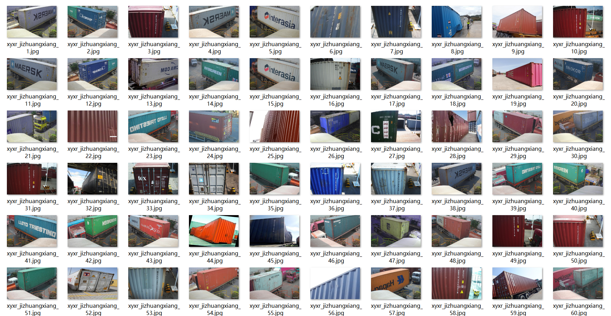
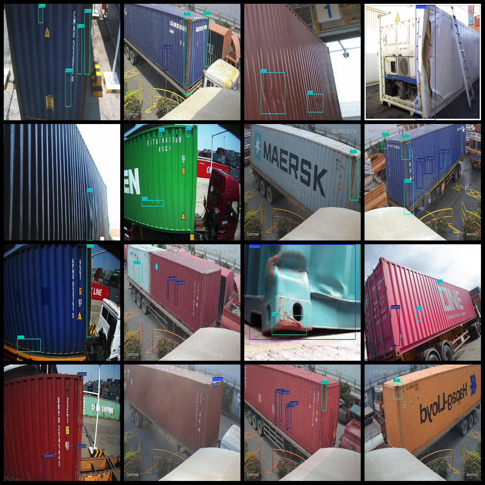

# [Object Detection] Container Defect Detection Dataset 1476 images5-classDefect VOC+YOLO format

Dataset Description: ~

Dataset format: Pascal VOC format + YOLO format (the txt file does not contain the split path, it only contains jpg images and corresponding VOC format xml files and yolo format txt files)

Number of images (number of jpg files): 1476

Number of annotations (number of xml files): 1476

Number of annotations (number of txt files): 1476

Number of callout categories: 5

Annotation class names: ["Deframe","Dent","Hole","Rusty","Scratch"]

Number of boxes labeled in each category:

Deframe frame count = 126

Dent frame count = 734

Hole frame count = 129

Rusty frame count = 2027

Scratch frame count = 1211

Total boxes: 4227

Use the labeling tool: labelImg

Rules for annotation: Draw a rectangle around the category.

## Images

---

Here is a pay link on Stripe (https://buy.stripe.com/3cs8yP7sY87d0vu9AB). Please contact me lonlonago@foxmail.com after funding $89, and I will send you a complete data files, thank you!

